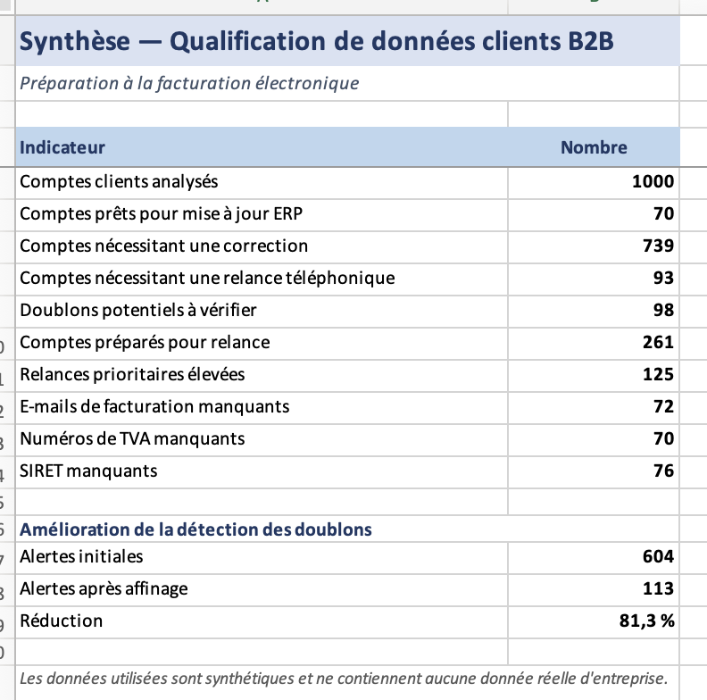
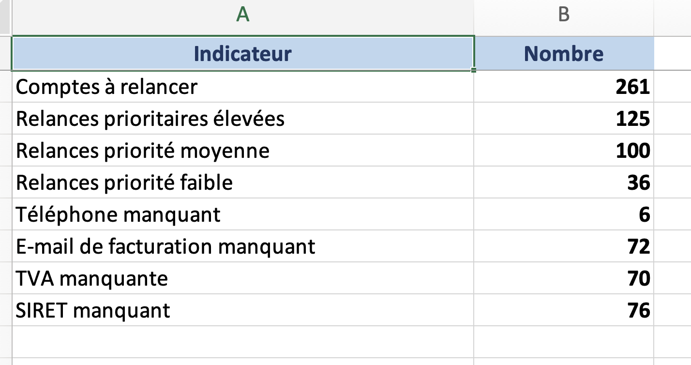

# Qualification de données clients B2B

J’ai fait ce petit projet pour travailler sur un cas proche d’une mission de Gestionnaire Data : partir d’un fichier client incomplet, repérer les problèmes importants, puis préparer des fichiers utilisables par une équipe métier.

Le contexte choisi est la facturation électronique : SIRET, TVA, e-mail de facturation, doublons et comptes à relancer.

## Ce que j’ai fait

J’ai généré un fichier fictif de 1 000 comptes clients B2B avec des erreurs volontairement ajoutées : SIRET manquant, TVA manquante, e-mail incorrect, contact absent, doublons, problèmes de formatage.

Ensuite, j’ai préparé trois sorties :

- un fichier qualifié avec les anomalies détectées ;
- une synthèse simple des principaux indicateurs ;
- un fichier de relance pour les comptes à contacter.

## Résultats

Sur 1 000 comptes analysés :

- 70 comptes prêts pour mise à jour ERP ;
- 739 comptes à corriger ;
- 98 doublons potentiels à vérifier ;
- 261 comptes préparés pour relance ;
- 72 e-mails de facturation manquants ;
- 70 numéros de TVA manquants ;
- 76 SIRET manquants.

J’ai aussi ajusté la détection des doublons pour éviter de signaler trop de faux positifs. La règle finale se base surtout sur le SIRET, ou sur le SIREN avec un nom d’entreprise très proche.

## Exemple de fichier de relance

L’idée était de ne pas s’arrêter au diagnostic, mais de préparer une suite concrète : quels comptes appeler, pourquoi les appeler, et quelle information demander.

## Fichiers

- `data/b2b_clients_raw.xlsx` — fichier brut fictif ;
- `outputs/b2b_clients_qualified.xlsx` — fichier qualifié ;
- `outputs/data_quality_summary.xlsx` — synthèse des contrôles ;
- `outputs/accounts_to_call.xlsx` — fichier de relance ;
- `outputs/executive_summary.xlsx` — résumé visuel.

## Outils

Python, pandas, openpyxl, Excel.

---

Les données sont fictives et ne contiennent aucune information réelle d’entreprise.